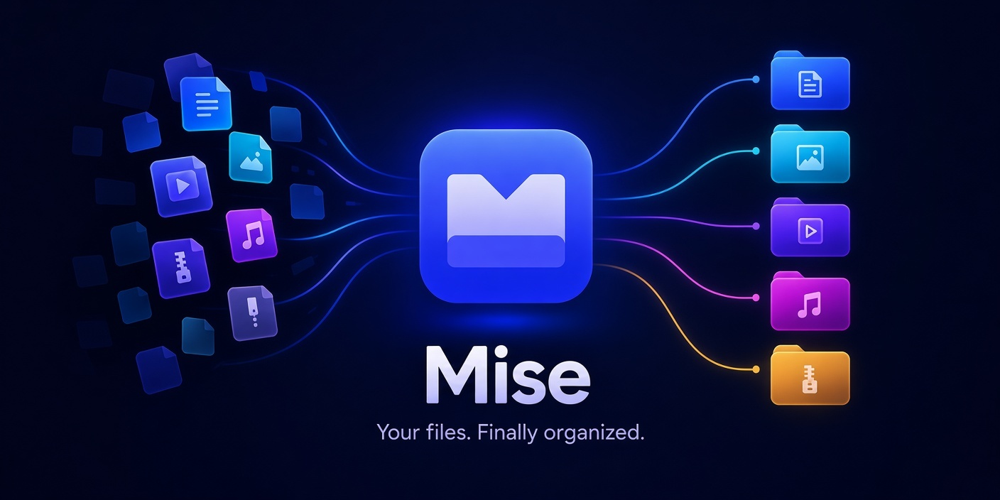
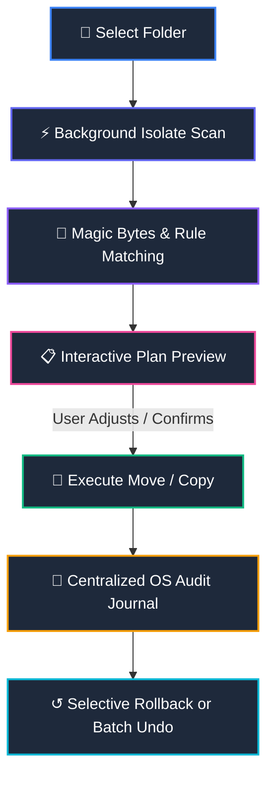

<p align="center">
  
</p>

<p align="center">
  <br>
  <h1 align="center">Mise</h1>
  <p align="center">
    <strong>/miːz/ &bull; <em>"Everything in its place"</em></strong><br>
    The open-source, local-first file organizer and disk intelligence workstation for desktop, mobile, and terminal.
  </p>
</p>

<p align="center">
  <a href="https://github.com/BezaleelPaul/file_organizer_flutter/releases/latest"></a>
  <a href="https://flutter.dev"></a>
  <a href="https://dart.dev"></a>
  
  
  <a href="LICENSE"></a>
</p>

<p align="center">
  <a href="#-quick-downloads">Downloads</a> &bull;
  <a href="#-why-mise">Why Mise</a> &bull;
  <a href="#-core-features">Features</a> &bull;
  <a href="#-how-it-works">How It Works</a> &bull;
  <a href="#-command-line-interface-cli">CLI</a> &bull;
  <a href="#-search-syntax-cheat-sheet">Query Syntax</a> &bull;
  <a href="#-comparison">Comparison</a> &bull;
  <a href="#-development--building">Build</a> &bull;
  <a href="#-share--spread-the-word">Share</a>
</p>

---

## 📥 Quick Downloads

Download ready-to-run release binaries for your operating system:

| Platform | Format | Download Link | Notes |
|:---|:---|:---|:---|
| **Windows** | Setup `.exe` | [**Download Installer**](https://github.com/BezaleelPaul/file_organizer_flutter/releases/download/v2.2.0/mise-setup-2.2.0.exe) | Inno Setup installer with start menu & desktop shortcuts |
| **Windows** | Portable `.zip` | [**Download ZIP**](https://github.com/BezaleelPaul/file_organizer_flutter/releases/download/v2.2.0/mise-windows.zip) | Portable release — extract and run anywhere |
| **Linux** | Debian / Ubuntu `.deb` | [**Download .deb**](https://github.com/BezaleelPaul/file_organizer_flutter/releases/download/v2.2.0/mise_2.2.0_amd64.deb) | Desktop integration, icons, and binary symlink |
| **Linux** | Standalone AppImage | [**Download AppImage**](https://github.com/BezaleelPaul/file_organizer_flutter/releases/download/v2.2.0/Mise-2.2.0-x86_64.AppImage) | Single executable for all Linux distributions |
| **Linux** | Tarball `.tar.gz` | [**Download tar.gz**](https://github.com/BezaleelPaul/file_organizer_flutter/releases/download/v2.2.0/mise-linux.tar.gz) | Raw bundle |
| **macOS** | Bundle `.tar.gz` | [**Download macOS Bundle**](https://github.com/BezaleelPaul/file_organizer_flutter/releases/download/v2.2.0/mise-macos.tar.gz) | Universal binary |
| **Android** | Packages `.tar.gz` | [**Download Android Bundle**](https://github.com/BezaleelPaul/file_organizer_flutter/releases/download/v2.2.0/mise-android.tar.gz) | Release APK & AppBundle with SAF support |

*(Looking for older versions? Visit the [GitHub Releases page](https://github.com/BezaleelPaul/file_organizer_flutter/releases).)*

---

## 💡 Why Mise?

Named after the culinary standard ***mise en place*** (*"everything in its place before cooking starts"*), **Mise** solves the chaotic desktop problem without compromising control or privacy.

> **"Most file organizers force you to choose between paying $42 for a single-platform utility, running risky terminal scripts with no undo, or handing file metadata to cloud servers. Mise is 100% offline, cross-platform, journaled, and mathematically collision-proof."**

```
❌ Traditional Sorters:
  Move files immediately ──> Overwrite collisions ──> Memory OOMs on 4GB video ──> No undo

✅ Mise Workflow:
  Streamed Isolate Scan ──> Interactive Plan Preview ──> Collision-Proof Safe Move ──> Selective Undo
```

---

## 🌟 Core Features

### 🛡️ 1. Zero-Fear Safety Architecture
* **Interactive Plan Preview:** Inspect every proposed file movement before executing. Review categories, rename patterns, and file sizes beforehand.
* **Selective Rollback:** Realized a single file was categorized incorrectly? Don't revert the entire 500-file run — roll back **individual specific files** or undo whole batches with a single click.
* **Collision-Proof Renaming:** Mise never overwrites existing target files. Collisions are automatically safely sequenced (`invoice.pdf` &rarr; `invoice (1).pdf`).
* **Centralized System Audit Journal:** Unlike tools that dump messy hidden files into your folders, Mise records transactions in your platform's application support directory (`%APPDATA%`, `~/Library`, `~/.local/share`). Target directories stay immaculate.

### ⚡ 2. 3-Stage Streamed Duplicate Engine (OOM-Proof)
Duplicate scanners often crash with Out-Of-Memory (OOM) errors on large media collections. Mise implements a tiered cascade filter:
1. **Stage 1 (O(1)):** Compares exact file sizes. Eliminates ~85% of distinct files instantly.
2. **Stage 2 (O(8KB)):** Compares first 4KB and last 4KB binary slices. Quick-matches headers and trailers.
3. **Stage 3 (Chunked Stream):** Streams full SHA-256 digests in 64KB bounded chunks. Consumes constant memory regardless of whether files are 5MB or 50GB.
* **Reclaimable Storage Treemap:** Interactive disk visualization showing wasted storage across directories with a 1-click duplicate cleaner that moves redundant copies safely to the reversible Trash folder.

### 🧠 3. Adaptive Local Intelligence (100% Offline)
* **Magic Byte Content Inspection:** Identifies PDFs, PNGs, MP3s, WebPs, and ZIPs by their binary signatures (`%PDF-`, `\x89PNG`, `ID3`), correctly classifying files even with missing or wrong extensions.
* **Self-Tuning User Feedback:** When you manually reclassify a file in the Plan Preview, Mise stores your preference locally and adapts its scoring model for future scans.
* **Zero Cloud Dependence:** No external API keys, zero network traffic, no background telemetry. Your personal files and directory structures never leave your machine.

### 🔍 4. Power Search & Smart Collections
Filter thousands of files instantaneously using a rich query operator syntax:
* **Extensions:** `ext:pdf`, `*.mov`
* **Categories:** `type:image`, `type:document`, `type:video`
* **Sizes:** `>100MB`, `<5KB`, `>=1GB`
* **Date Windows:** `modified:last-week`, `modified:year`, `after:2026-01-01`
* **Virtual Tags:** Organize files with colorful metadata tags (`tag:taxes`, `tag:work`) and save queries as dynamic **Smart Collections**.

### 💻 5. Multi-Platform & Background Automation
* **Desktop Native:** Full support for Windows 10/11, macOS, and Linux with Material 3 styling, adaptive navigation rails, and light/dark theme toggle.
* **System Tray Daemon:** Runs quietly in the system tray. Quick-launch folder actions or let background watchers auto-organize downloads with configurable debounce timers.
* **Android Support:** Full integration with Android's Storage Access Framework (SAF) for organizing mobile Downloads and DCIM storage.

---

## 🔄 How It Works



1. **Scan:** Reads folder hierarchy inside a background Dart Isolate without causing UI stutter.
2. **Analyze:** Evaluates extension rules, size buckets, date patterns, and binary magic bytes.
3. **Preview:** Displays a clear blueprint of all planned changes. You can tweak categories or exclude files.
4. **Execute:** Executes moves atomically with automatic collision resolution (`filename (1).ext`).
5. **Undo:** Any operation can be partially or completely reverted at any time.

---

## 🖥️ Command-Line Interface (CLI)

Mise includes a headless CLI powered by the exact same engine. Perfect for cron jobs, terminal workflows, and CI/CD pipelines.

```bash
# Preview planned changes without modifying any files (dry run)
mise plan ~/Downloads

# Organize files into standard categories
mise organize ~/Downloads

# Organize with date-based subfolders (YYYY-MM)
mise organize ~/Downloads --by-date

# Detect byte duplicates and move redundancies to Trash safely
mise organize ~/Downloads --detect-duplicates --duplicates-to-trash

# Output machine-readable JSON for bash scripts and pipelines
mise stats ~/Downloads --json
```

### Example Terminal Output

```
$ mise plan ~/Downloads
🔍 Scanning /Users/bezaleel/Downloads ...
✓ Found 164 files (4.8 GB) in 142ms

Proposed Organization Plan:
├── 📁 Images/         68 files (1.4 GB)   [PNG, JPG, SVG, WebP]
├── 📁 Documents/      42 files (320 MB)   [PDF, DOCX, XLSX]
├── 📁 Archives/       24 files (2.2 GB)   [ZIP, TAR.GZ, 7Z]
├── 📁 Development/    18 files (140 MB)   [DART, JSON, PY, YAML]
└── 🗑️ Duplicates/     12 files (740 MB)   --> Moved to Trash [Reversible]

0 files overwritten. Run 'mise organize ~/Downloads' to apply.
```

---

## 🔎 Search Syntax Cheat Sheet

Mise's built-in search bar supports granular compound expressions:

| Operator | Syntax Example | Meaning |
|:---|:---|:---|
| **Free Text** | `contract` | Matches any file containing "contract" in its name |
| **Extension** | `ext:pdf` or `*.zip` | Filter by specific file extension |
| **Category** | `type:image`, `type:audio` | Match any extension within that category |
| **Size Greater**| `>50MB`, `>=1GB` | Files larger than threshold |
| **Size Smaller**| `<10KB`, `<=2MB` | Files smaller than threshold |
| **Timeframe** | `modified:last-week` | Modified within the past 7 days |
| **Year Window** | `modified:2026` | Modified during year 2026 |
| **Date Range** | `after:2026-01-01 before:2026-06-30` | Modified between two dates |
| **Tags** | `tag:work tag:finance` | Files labeled with virtual tags |
| **Combined** | `type:image >5MB modified:this-month` | Full Boolean AND query combination |

---

## 📊 Comparison

How Mise stands against existing solutions:

| Feature | **Mise** | **Hazel** | **File Juggler** | **DropIt** | **Python `organize`** |
|:---|:---:|:---:|:---:|:---:|:---:|
| **Platforms** | **Windows, macOS, Linux, Android, iOS** | macOS only | Windows only | Windows only | Any (Terminal) |
| **Pricing** | **Free & Open Source (MIT)** | $42 / license | $40 / license | Free | Free |
| **User Interface** | **Modern Material 3 GUI + CLI + Tray** | System Prefs pane | Legacy Win32 | Floating desktop box | None (YAML file) |
| **Undo Safety** | **Per-file Selective + Full Batch Undo** | Basic Trash | Basic Trash | Limited | Dry-run only |
| **Duplicate Finder** | **Streamed 3-Stage SHA-256 + Treemap** | ❌ None | ❌ None | ❌ None | Basic |
| **Offline Privacy** | **100% Local (Zero network calls)** | 100% Local | 100% Local | 100% Local | 100% Local |
| **Memory Footprint**| **Bounded 64KB Stream (OOM-Safe)** | Moderate | Moderate | Moderate | Moderate |
| **System Tray** | **Yes (Background Watch & Shortcuts)** | Menu Bar | Tray Icon | Floating Drop Area | ❌ No |

---

## 🏗️ Project Architecture

Mise is structured around modular, single-responsibility controllers and services:

```
file_organizer_flutter/
├── bin/
│   └── mise.dart                    # Headless CLI entry point
├── lib/
│   ├── main.dart                    # Application bootstrap & desktop window setup
│   ├── state/
│   │   ├── organize_controller.dart # Scan, plan, execute, and rollback logic
│   │   ├── storage_controller.dart  # Duplicates, disk treemap, and file analysis
│   │   ├── search_controller.dart   # File search index, tags, and collections
│   │   ├── watch_controller.dart    # Folder watchers and interval schedules
│   │   └── settings_controller.dart # Theme, layout, and user preferences
│   ├── services/
│   │   ├── organize_service.dart    # Organization core execution
│   │   ├── disk_scanner.dart        # Background Isolate folder traversal
│   │   ├── history_store.dart       # Centralized OS application-support storage
│   │   ├── suggestion_engine.dart   # Magic bytes and adaptive keyword heuristics
│   │   └── tray_service.dart        # System tray menu and background icon
│   └── views/                       # Responsive Material 3 views and dialogs
└── test/                            # 94 comprehensive unit and integration tests
```

---

## 🛠️ Development & Building

### Prerequisites
* [Flutter SDK](https://docs.flutter.dev/get-started/install) **3.41.x+**
* [Dart SDK](https://dart.dev/get-dart) **3.11+**
* Native build tools for your host OS (Visual Studio C++ on Windows, Xcode on macOS, GTK3 development libraries on Linux).

### Local Setup
```bash
# 1. Clone repository
git clone https://github.com/BezaleelPaul/file_organizer_flutter.git
cd file_organizer_flutter

# 2. Get dependencies
flutter pub get

# 3. Run test suite (94 passing tests)
flutter test

# 4. Launch development application
flutter run -d windows    # Options: windows, macos, linux, android
```

### Production Packaging
```bash
# Windows
flutter build windows --release

# Linux
flutter build linux --release
bash scripts/package_linux.sh   # Creates .deb and .AppImage packages

# macOS
flutter build macos --release

# Android
flutter build apk --release
flutter build appbundle --release
```

---

## 📢 Share & Spread the Word

Love Mise or building in public? Help the project grow and share it with your network:

<details>
<summary>📋 <strong>Copy Ready-to-Post LinkedIn Template (Engineering & Systems Architecture Focus)</strong></summary>

<br>

```text
Why most file organizers crash on large files — and how I built an OOM-proof architecture. 🚀

If you've ever written `await file.readAsBytes()` in Dart, you've introduced a silent memory bomb into your app. Load three 4GB 4K videos simultaneously, and your app will instantly crash with an Out-of-Memory (OOM) exception.

When designing Mise — an open-source, local-first file organizer and disk intelligence workstation — I engineered a 3-stage cascade pipeline to make scanning 50GB+ libraries effortless on a bounded memory footprint:

🔹 Stage 1 (O(1)): Size Matching — eliminates ~85% of non-duplicates in microseconds before doing any I/O.
🔹 Stage 2 (O(8KB)): Signature Slicing — only compares head & tail binary blocks.
🔹 Stage 3 (Bounded Memory Stream): Full SHA-256 digests stream `file.openRead()` in 64KB chunks directly into the crypto digest. Memory consumption stays flat regardless of file size.
🔹 Zero-Jank Traversal: Recursive directory walking is offloaded to background Dart Isolates, keeping the UI pinned at 60/120 FPS.
🔹 Selective Rollback: Transactions are recorded in OS Application Support directories (%APPDATA%, ~/Library), allowing users to undo individual file movements rather than reverting an entire batch.

The project is 100% offline, privacy-first, and features native builds across Windows, macOS, Linux, Android, and a headless CLI.

Check out the code, architecture docs, and v2.2.0 release on GitHub:
👉 https://github.com/BezaleelPaul/file_organizer_flutter

#Flutter #Dart #OpenSource #SoftwareEngineering #SystemDesign #CrossPlatform #DesktopApps #CleanArchitecture
```

</details>

<details>
<summary>📋 <strong>Copy Ready-to-Post LinkedIn Template (Product & Builder Focus)</strong></summary>

<br>

```text
I got tired of messy Downloads folders and $42 single-platform utilities. So I built an open-source alternative that runs everywhere. 💻

Meet Mise (/miːz/) — named after the culinary philosophy "mise en place" ("everything in its place").

Most file organizers force you to choose between paying $40+ for single-platform tools, using risky scripts with no undo safety net, or uploading personal file metadata to the cloud.

Mise is built different:
✅ 100% Offline & Private (Zero cloud calls, zero telemetry)
✅ Safety-Guaranteed (Interactive Plan Preview + per-file selective rollback)
✅ Cross-Platform Native (Windows, macOS, Linux, Android, and a headless CLI)
✅ High Performance (Streamed 3-stage duplicate finder + reclaimable space treemap)

Completely open source under the MIT license with 94 automated tests.

Check out the repository and grab the v2.2.0 installer:
👉 https://github.com/BezaleelPaul/file_organizer_flutter

If you find it useful, leave a ⭐️ on GitHub!

#OpenSource #FlutterDev #Productivity #DeveloperCommunity #BuildInPublic #Coding
```

</details>

---

## 🤝 Contributing

Contributions are welcome! Whether it's adding new file signatures, improving localized heuristics, or enhancing mobile workflows:

1. Fork the repository.
2. Create your feature branch (`git checkout -b feat/amazing-feature`).
3. Ensure all tests and analyzers pass cleanly:
   ```bash
   flutter analyze
   flutter test
   ```
4. Commit your changes with conventional commit syntax (`git commit -m 'feat: add audio album tag extraction'`).
5. Push to your branch and open a Pull Request.

---

## 📄 License

Mise is open-source software licensed under the **[MIT License](LICENSE)**.
Created with ❤️ by [Bezaleel Paul](https://github.com/BezaleelPaul) and contributors.
